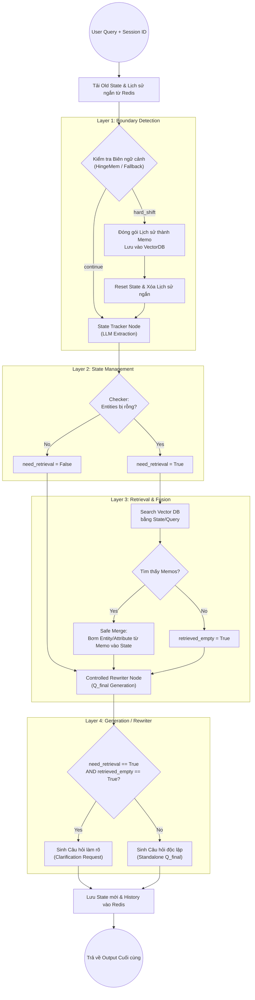

# TÀI LIỆU ĐẶC TẢ KIẾN TRÚC HỆ THỐNG: STATE-CENTRIC ADAPTIVE PIPELINE
*(Dự án: Retrieval-Multiturn-RAG)*

Dự án này là một hệ thống RAG (Retrieval-Augmented Generation) tiên tiến, chuyên giải quyết các vấn đề phức tạp trong **hội thoại nhiều lượt (Multi-turn RAG)** thông qua cơ chế quản lý trạng thái (State-Centric) và duy trì trí nhớ dài hạn (Long-term Memory / Memos). 

Hệ thống cho phép duy trì câu chuyện từ tuần trước, giải quyết triệt để vấn đề "nó", "cái kia" (tĩnh lược đại từ), và chống "ảo giác" khi bị mất dấu ngữ cảnh.

---

## 1. Dữ Liệu Đầu Vào & Đầu Ra Tổng Thể (System I/O)

* **ĐẦU VÀO (System Input):**
  - `user_query` (String): Câu hỏi thô của người dùng ở lượt hiện tại (Ví dụ: *"Nó có giá bao nhiêu?"*).
  - `session_id` (String): Định danh duy nhất của phiên chat, dùng để móc nối dữ liệu trong in-memory/Redis và Vector DB.

* **ĐẦU RA (System Output):**
  - `q_final` (String): Câu truy vấn độc lập, hoàn chỉnh, đã được giải quyết đại từ và đầy đủ ngữ cảnh để đưa vào hệ thống Search/RAG (Ví dụ: *"iPhone 15 Pro Max có giá bao nhiêu?"*). 
  - **HOẶC** một **Clarification Request** (Câu hỏi làm rõ) nếu hệ thống phát hiện mất thông tin không thể cứu vãn (Anti-Hallucination).

---

## 2. Sơ đồ Luồng Hoạt Động Chi Tiết (Pipeline Flowchart)

Dưới đây là sơ đồ chi tiết về vòng đời của một câu hỏi khi đi qua hệ thống.

---

## 3. Chi Tiết Từng Node Trong Pipeline

Pipeline hoạt động tuyến tính qua 4 lớp cốt lõi. Dưới đây là mô tả cấu trúc JSON của State và chi tiết cơ chế của mỗi Node.

### Cấu trúc dữ liệu: `ConversationState` (Lõi của hệ thống)
Mọi thông tin hội thoại được LLM bóc tách và duy trì dưới định dạng JSON Schema:
- `intent` (String): Mục đích của câu hỏi (inquiry, compare, ...).
- `entities` (Dict): Thực thể cốt lõi (VD: `{"tài_sản": "Hàng tồn kho"}`). **Đây là biến quyết định xem có cần bật `need_retrieval` hay không.**
- `attributes` (Dict): Khía cạnh của thực thể (VD: `{"khái_niệm": "Giá gốc"}`).
- `constraints` (List): Các điều kiện giới hạn (VD: `["áp dụng cho doanh nghiệp vừa"]`).
- `unresolved_references` (List): Các đại từ đang nằm chờ giải quyết (VD: `["nó", "đó"]`).

---

### Lớp 1: Boundary Detection Layer (Phát hiện Ranh giới Chủ đề)
*Mã nguồn: `src/nodes/boundary.py`*

- **Bản chất (What it is):** Một bộ lọc (filter) gồm nhiều lớp để đánh giá ý định chuyển chủ đề.
- **Mục đích (What it does):** Ngăn chặn hệ thống mang nhầm ngữ cảnh (Constraints, Entities) của câu chuyện cũ sang câu chuyện mới, tránh hiện tượng "râu ông nọ cắm cằm bà kia".
- **I/O Của Node:**
  - *Input:* `user_query`, `active_chat` (Lịch sử N tin nhắn gần nhất).
  - *Output:* Quyết định `"hard_shift"` (đổi chủ đề) hoặc `"continue"` (tiếp tục).
- **Luồng logic bên trong (3 Layer):**
  1. **Layer 0 (Rule-based / Pronouns):** Quét câu hỏi xem có chứa các đại từ thay thế tiếng Việt ("nó", "đó", "kia", "họ"...) không. Nếu có $\rightarrow$ Rõ ràng là đang ám chỉ chuyện cũ $\rightarrow$ Trả về `continue` (đại từ không thể mở đầu 1 topic hoàn toàn mới). Tiết kiệm chi phí gọi LLM.
  2. **Layer 1 (Rule-based / Jaccard):** Loại bỏ stop-words (từ nối, hư từ) khỏi câu hỏi và lượt chat trước đó. Nếu tìm thấy ít nhất 2 từ vựng nội dung (content words) giống nhau $\rightarrow$ Cùng chủ đề $\rightarrow$ `continue`.
  3. **Layer 2 (LLM Fallback):** Nếu 2 rule trên không thỏa mãn, gọi một mô hình LLM siêu nhẹ (SLM) để đọc ngữ nghĩa và phán quyết `hard_shift` hay `continue`.
- **Hành động sau Node:** Nếu kết quả là `hard_shift`, hệ thống gọi hàm `archive_to_memo` để dùng LLM tóm tắt đoạn chat cũ thành một Memo đẩy vào Vector DB, rồi Xóa sạch (Reset) State để nhường chỗ cho chủ đề mới.

### Lớp 2: State Management Layer (Trích xuất và Quản lý Trạng thái)
*Mã nguồn: `src/nodes/tracker.py`*

- **Bản chất:** Một Agent (LLM) đóng vai trò làm người ghi chép biên bản cuộc họp.
- **Mục đích:** Cập nhật bảng JSON Schema để theo dõi người dùng đang nói về cái gì.
- **I/O Của Node:**
  - *Input:* `user_query`, `old_state` (JSON của lượt $t-1$).
  - *Output:* `new_state` (JSON cập nhật), `need_retrieval` (Boolean).
- **Luồng logic bên trong:**
  - **Tracker:** Hợp nhất `user_query` và `old_state` để ghi đè hoặc thêm mới `Entities`, `Attributes`, `Constraints`.
  - **Checker:** Kiểm tra bản ghi `new_state`. Nếu trường `Entities` hoàn toàn rỗng `{}`, hệ thống nhận ra nó đã "mất dấu" đối tượng thảo luận $\rightarrow$ Bật cờ `need_retrieval = True` để kích hoạt tìm kiếm trong quá khứ. Ngược lại, gán `False`.

### Lớp 3: Retrieval & Fusion Layer (Tìm kiếm và Hợp nhất Ký ức)
*Mã nguồn: `src/services/vector_db.py` & `src/nodes/retriever.py`*

- **Bản chất:** Cầu nối liên kết Trí nhớ ngắn hạn với Trí nhớ dài hạn (Memos).
- **Mục đích:** Lấy lại dữ liệu của các phiên chat từ trước đó (đã bị xóa khỏi active_chat).
- **I/O Của Node:**
  - *Input:* `new_state`, cờ `need_retrieval`, `session_id`.
  - *Output:* `new_state` (có thể được bổ sung), cờ `retrieved_empty` (Boolean).
- **Luồng logic bên trong:**
  - Bỏ qua toàn bộ nếu `need_retrieval == False`.
  - Nếu `True`, sử dụng `new_state.entities` (hoặc raw query) để search trong Vector DB.
  - **Tìm thấy:** Chạy hàm **Safe Merge** (`safe_merge`). Thuật toán cẩn thận đắp các `Entities` từ Memo tìm được vào chỗ trống trong `new_state`, nhưng giữ nguyên các `Constraints` mới mà người dùng vừa đặt ra ở lượt này.
  - **Không tìm thấy:** Bật cờ `retrieved_empty = True` để báo hiệu cơ sở dữ liệu đã cạn kiệt thông tin.

### Lớp 4: Generation Layer (Viết lại câu hỏi & Anti-Hallucination)
*Mã nguồn: `src/nodes/rewriter.py`*

- **Bản chất:** LLM tổng hợp thông tin, xử lý các góc chết.
- **Mục đích:** Trả về đầu ra an toàn tuyệt đối. Đảm bảo câu hỏi có đủ ý nghĩa để hệ thống RAG下游 (downstream) search chuẩn xác.
- **I/O Của Node:**
  - *Input:* `user_query`, `new_state` (đã hợp nhất), `retrieved_empty` (Boolean).
  - *Output:* Câu hỏi `q_final` hoàn chỉnh HOẶC một câu phản hồi yêu cầu làm rõ (Clarification).
- **Luồng logic bên trong:**
  - **Controlled Rewrite:** LLM thay thế toàn bộ đại từ (nó, cái kia, công ty ấy) bằng cụm từ chỉ đích danh lấy từ bảng `Entities`. Xóa bỏ các nhiễu loạn để tạo ra Standalone Query ($Q_{final}$).
  - **Graceful Fallback (Xử lý Ngoại lệ):** 
    - *Điều kiện kích hoạt:* Nếu `need_retrieval == True` (mất dấu) VÀ `retrieved_empty == True` (Vector DB không có dữ liệu).
    - *Cơ chế Anti-Hallucination:* Hệ thống **chủ động từ chối tự biên tự diễn (hallucinate)**. Thay vào đó, nó sinh ra một Clarification Request.
    - *Ví dụ output:* *"Tôi không tìm thấy thông tin về 'sản phẩm cũ' mà bạn đang nhắc đến trong lịch sử trò chuyện. Bạn có thể nói rõ tên sản phẩm để tôi tìm kiếm không?"*

---

## 4. Cơ chế Persistence (Bền vững Dữ liệu)

Sau khi Lớp 4 hoàn thành, hệ thống thực hiện hai thao tác lưu trữ (tại `src/core/state.py`):
1. **Save State:** Lưu toàn bộ `new_state` vào Redis theo `session_id`. Trạng thái này sẽ tái sinh thành `old_state` cho lần trò chuyện tiếp theo.
2. **Save History:** Nạp câu `user_query` và `q_final` vào danh sách `active_chat` (Lịch sử ngắn hạn) để cấp ngữ cảnh cho Lớp 1 (Boundary) trong lượt tới.