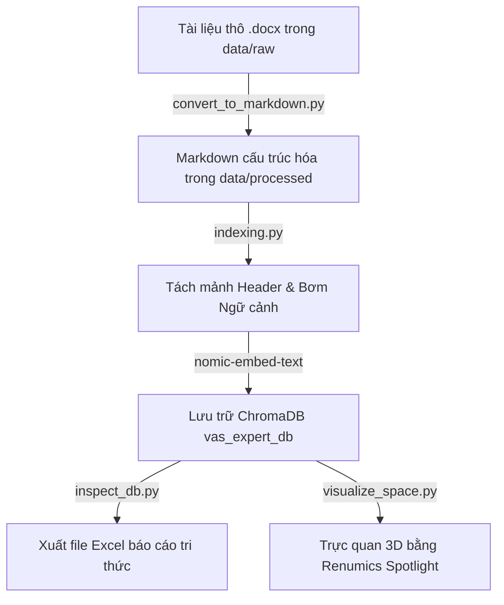

# Tối ưu hóa truy vấn RAG Multi-turn (Vietnam Accounting Standards - VAS)

Dự án này triển khai hệ thống **State-Centric Adaptive Pipeline** nhằm tối ưu hóa câu truy vấn trong hội thoại đa lượt (multi-turn), ứng dụng vào kho tài liệu **Chuẩn mực Kế toán Việt Nam (VAS)**. Hệ thống giải quyết các bài toán về đại từ mơ hồ ("nó", "khoản đó"), tham chiếu ẩn ý và chuyển đổi chủ đề đột ngột (`hard_shift`) của người dùng trong các phiên chat liên tục.

---

## 1. Kiến trúc Hệ thống

Quy trình xử lý của hệ thống được chia làm 5 lớp cốt lõi:
1. **Lớp Biên Ngữ Cảnh (Boundary Detection)**: Sử dụng so khớp Jaccard kết hợp mô hình ngôn ngữ nhỏ (SLM) để nhận diện chuyển chủ đề (`hard_shift` / `continue`). Khi có `hard_shift`, hệ thống tự động nén lịch sử trò chuyện cũ thành một Memo lưu vào cơ sở dữ liệu vector và xóa sạch trạng thái phiên cũ.
2. **Lớp Quản Lý Trạng Thái (State Management)**: Sử dụng LLM để trích xuất Intent, Entities, Attributes, Constraints và Unresolved References để cập nhật vào `ConversationState`.
3. **Lớp Hợp Nhất Ký Ức (Retrieval & Fusion)**: Khi phát hiện thiếu ngữ cảnh (`need_retrieval` = True), hệ thống truy tìm các Memo tương ứng trong quá khứ và điền vào các ô trống (Safe Merge) trong State hiện tại.
4. **Lớp Viết Lại Truy Vấn (Generation Layer)**: Tái cấu trúc câu hỏi thô thành câu hỏi độc lập ($Q_{final}$) hoàn chỉnh ngữ nghĩa hoặc phản hồi yêu cầu người dùng làm rõ (Clarification Request) nếu thông tin bị thiếu hụt hoàn toàn.
5. **Lớp Truy Xuất Tri Thức (RAG Retrieval)**: Dùng $Q_{final}$ để tìm kiếm tài liệu chuẩn xác nhất từ cơ sở dữ liệu tri thức VAS.

---

## 2. Quy trình Xử lý Dữ liệu (Data Pipeline)

Hệ thống xử lý tài liệu thô kế toán và xây dựng cơ sở dữ liệu tri thức thông qua 4 bước tự động hóa trong thư mục `data_pipeline/`:



### Bước 1: Cấu trúc hóa tài liệu thô (`convert_to_markdown.py`)
* Đọc các tài liệu Word (`.docx`) thô trong `data/raw/` (ví dụ: Chuẩn mực 26 về Thông tin các bên liên quan).
* Phân tích thuộc tính XML của file Word (Outline Level) để ánh xạ chính xác các đề mục từ lớn đến nhỏ thành Heading Markdown tương ứng (`#` đến `####`).
* Sử dụng Regex nhận diện các điều khoản/điểm số dạng số thứ tự (ví dụ: `1.`, `a)`, `1.1.`) để đưa vào cấp độ H5 (`#####`).
* Tự động chuyển đổi các bảng biểu dạng lưới Word sang bảng biểu Markdown tiêu chuẩn.

### Bước 2: Phân tách tầng tri thức và Đánh chỉ mục (`indexing.py`)
* Sử dụng `MarkdownHeaderTextSplitter` để chia nhỏ file `.md` thành các mảnh tri thức dựa trên cấu trúc các Heading:
  * `#` ➔ Standard (Chuẩn mực)
  * `##` ➔ Chapter (Chương)
  * `###` ➔ Section (Mục)
  * `####` ➔ Article (Điều)
  * `#####` ➔ Point (Khoản/Điểm)
* Đối với các mục quá dài (> 2000 ký tự), hệ thống băm nhỏ bằng `RecursiveCharacterTextSplitter` (overlap 200 ký tự để giữ tính liên tục).
* **Bơm Ngữ cảnh (Context Injection):** Bổ sung tiền tố `【NGỮ CẢNH: Standard > Chapter > Section > Article】` vào đầu từng chunk để tránh mất thông tin điều khoản gốc khi tìm kiếm đơn lẻ.
* Vector hóa các chunk thông qua model `nomic-embed-text` của Ollama và nạp vào collection `vas_expert_db` trong database Chroma.

### Bước 3: Trích xuất & Kiểm tra Tri thức (`inspect_db.py`)
* Kết nối tới database Chroma, giải nén các metadata và tài liệu chunk.
* Xuất toàn bộ cấu trúc tri thức (tên chuẩn mực, chương, điều, khoản, độ dài và nội dung text) ra file Excel tiện dụng [Kiem_tra_tri_thuc_VAS.xlsx](file:///d:/school/C%C3%A1c%20v%E1%BA%A5n%20%C4%91%E1%BB%81/retrieval-multiturn-rag/data/Kiem_tra_tri_thuc_VAS.xlsx) để kiểm tra chất lượng phân mảnh bằng mắt thường.

### Bước 4: Bản đồ hóa không gian Vector (`visualize_space.py`)
* Kết nối tới database Chroma để lấy cả vector embeddings, metadata và nội dung văn bản.
* Khởi chạy thư viện trực quan hóa `renumics spotlight` tại địa chỉ `http://localhost:8000` để vẽ bản đồ phân bố các chunk tri thức dưới dạng 3D, giúp phân tích mật độ phân bố và kiểm tra độ tương đồng ngữ nghĩa trực quan.

---

## 3. Cấu trúc Thư mục Dự án

```text
retrieval-multiturn-rag/
├── data/                             # Dữ liệu nguồn và kết quả kiểm thử
│   ├── raw/                          # Tài liệu gốc (.docx, .doc, .pdf)
│   ├── processed/                    # File Markdown (.md) sau khi parse cấu trúc
│   ├── test_dataset.xlsx             # Bộ 35 câu hỏi đánh giá hội thoại đa lượt
│   └── evaluation_results.xlsx       # Kết quả đánh giá chạy tự động
├── data_pipeline/                    # Pipeline xử lý dữ liệu & index Vector DB
│   ├── convert_to_markdown.py        # Parse Word sang Markdown cấu trúc
│   ├── indexing.py                   # Chunking và nạp ChromaDB
│   ├── inspect_db.py                 # Xuất DB ra Excel
│   └── visualize_space.py            # Trực quan hóa vector space
├── src/                              # Mã nguồn cốt lõi của RAG Pipeline
│   ├── core/
│   │   ├── schema.py                 # Pydantic schemas (ConversationState, TrackerOutput)
│   │   └── state.py                  # Quản lý State, history cache và logic Memo
│   ├── nodes/
│   │   ├── boundary.py               # Node phát hiện biên ngữ cảnh (HingeMem/SLM)
│   │   ├── tracker.py                # Node theo dõi trạng thái thực thể (LLM Tracker)
│   │   ├── retriever.py              # Node Safe Merge điền ô trống từ Memo
│   │   └── rewriter.py               # Node Controlled Rewrite sinh ra Q_final
│   └── services/
│   │   ├── llm.py                    # Khởi tạo LLM Client (OpenAI / Ollama Local)
│   │   └── vector_db.py              # Thao tác tìm kiếm Chroma DB & Memo DB
├── tests/
│   └── test_pipeline.py              # Bộ kiểm thử tự động đọc dataset và chấm điểm
├── main.py                           # Giao diện CLI tương tác RAG Multi-turn
├── requirements.txt                  # Danh sách thư viện phụ thuộc
└── README.md                         # Hướng dẫn dự án này
```

---

## 4. Hướng dẫn Thiết lập và Vận hành

### Yêu cầu hệ thống
* Python 3.10 trở lên
* Ollama (đã cài đặt và tải sẵn model `nomic-embed-text` và `qwen2.5:3b`)

### Cài đặt
1. Cài đặt các thư viện phụ thuộc:
   ```bash
   pip install -r requirements.txt
   ```
2. (Tùy chọn) Nếu muốn dùng OpenAI API, tạo file `.env` ở thư mục gốc và cấu hình khóa API:
   ```env
   OPENAI_API_KEY=your-api-key-here
   ```
   *Nếu không cấu hình, hệ thống sẽ tự động dùng local model `qwen2.5:3b` qua Ollama.*

### Vận hành
* **Trò chuyện trực tiếp trên Terminal:**
   ```bash
   python main.py
   ```
   *Nhập câu hỏi để bắt đầu hội thoại đa lượt, nhập `reset` để xóa phiên trò chuyện hiện tại, nhập `exit` để thoát.*

* **Chạy đánh giá tự động trên tập dữ liệu kiểm thử:**
   ```bash
   python -m unittest tests/test_pipeline.py
   ```
   *Kết quả đánh giá chi tiết của 35 test case sẽ được lưu lại trong file `data/evaluation_results.xlsx`.*