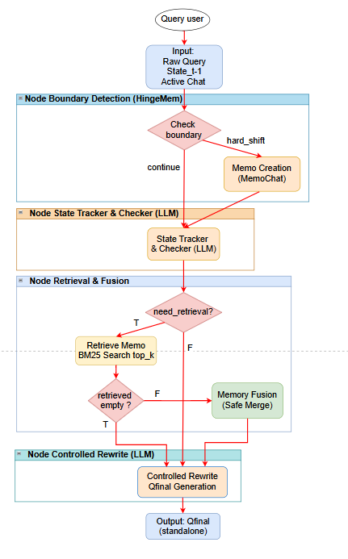

# HỆ THỐNG TRỢ LÝ KẾ TOÁN VAS: STATE-CENTRIC ADAPTIVE PIPELINE
*(Dự án: Retrieval-Multiturn-RAG)*

Dự án này là một hệ thống RAG (Retrieval-Augmented Generation) tiên tiến, chuyên giải quyết các vấn đề phức tạp trong **hội thoại nhiều lượt (Multi-turn RAG)** đối với lĩnh vực Chuẩn mực Kế toán Việt Nam (VAS). Hệ thống áp dụng cơ chế quản lý trạng thái động (State-Centric) và duy trì trí nhớ dài hạn thích ứng (Adaptive Long-term Memory / Memos) để xử lý triệt để các vấn đề tĩnh lược đại từ ("nó", "cái đó") và phòng chống hiện tượng ảo giác (hallucination) trong các phiên hội thoại kéo dài.

---

## 1. Sơ đồ Kiến trúc Hệ thống (System Architecture)

Dưới đây là sơ đồ kiến trúc luồng xử lý chi tiết của hệ thống:



---

## 2. Chi Tiết Từng Node Trong Pipeline

Hệ thống hoạt động theo luồng tuyến tính đi qua 4 tầng xử lý cốt lõi:

### Layer 1: Boundary Detection (Phát hiện vùng biên hội thoại)
* **Nhiệm vụ**: Xác định xem câu hỏi mới của người dùng đang tiếp tục chủ đề cũ (`continue`) hay đã chuyển sang một chủ đề hoàn toàn mới (`hard_shift`).
* **Cơ chế hoạt động**:
  1. **Token/Length Limit**: Nếu bộ nhớ ngắn hạn vượt quá dung lượng (~2000 tokens / 8000 ký tự), hệ thống tự động ngắt biên để tránh tràn cửa sổ ngữ cảnh, trả về `hard_shift`.
  2. **Pronoun Check (Bộ lọc đại từ)**: Kiểm tra nhanh nếu câu hỏi mới chứa các đại từ chỉ định/thay thế tiếng Việt ("nó", "đó", "cái đó", "khoản đó", "cái này"...) -> Có tính liên kết ngữ cảnh -> Tự động xác định là `continue` mà không cần gọi LLM (giúp tối ưu chi phí và độ trễ).
  3. **Entity & Semantic Shift (Độ lệch thực thể & Ngữ nghĩa)**: Sử dụng khoảng cách Jaccard để tính toán độ lệch thực thể và khoảng cách cosine cho độ lệch ngữ nghĩa. Nếu cả hai độ lệch vượt ngưỡng thiết lập -> Xác định là `hard_shift`.
  4. **LLM Fallback**: Trong trường hợp không kích hoạt được các luật trên, gọi một mô hình ngôn ngữ nhỏ (SLM) để phán quyết.
* **Hành động khi Hard Shift**: Đóng gói toàn bộ lịch sử ngắn hạn trước đó thành một **Memo** (Trí nhớ dài hạn) đưa vào Vector DB, sau đó xóa sạch lịch sử ngắn và reset trạng thái (`State`).

### Layer 2: State Tracker & Checker (Quản lý trạng thái ngữ cảnh)
* **Nhiệm vụ**: Theo dõi và cập nhật liên tục các thông tin cốt lõi đang thảo luận trong bảng trạng thái `ConversationState` (bao gồm: Intent, Entities, Attributes, Constraints, Unresolved References).
* **Cơ chế hoạt động**: 
  * Gọi LLM để trích xuất thông tin từ câu hỏi mới và hợp nhất (`merge`) với trạng thái cũ.
  * **Checker Logic**: Kiểm tra xem trường `entities` trong trạng thái mới có bị rỗng hay không. Nếu rỗng (hệ thống bị mất dấu đối tượng thảo luận do câu hỏi lấp lửng khi vừa chuyển cảnh) -> Gán cờ `need_retrieval = True`. Ngược lại, gán `need_retrieval = False`.

### Layer 3: Retrieval & Fusion (Truy xuất và Hợp nhất ký ức)
* **Nhiệm vụ**: Bù đắp các khoảng trống thông tin trong trạng thái hiện tại bằng cách truy hồi các Memos liên quan từ Vector DB.
* **Cơ chế hoạt động**: 
  * Sử dụng từ khóa thực thể hiện tại hoặc câu hỏi gốc để tìm kiếm các Memos trong Vector DB.
  * **Safe Merge (Dung hợp an toàn)**: Nếu cờ `need_retrieval == True` và tìm thấy Memos, hệ thống sẽ tiến hành "bơm" (điền vào chỗ trống) các thực thể/thuộc tính tương thích từ Memo vào trạng thái hiện tại. Thuật toán đảm bảo không ghi đè lên các thực thể/ràng buộc đã được xác định tường minh ở lượt hội thoại hiện tại.

### Layer 4: Controlled Query Rewriter (Viết lại câu hỏi có kiểm soát)
* **Nhiệm vụ**: Chuyển đổi câu hỏi thô lấp lửng của người dùng thành một câu hỏi độc lập ($Q_{final}$) chứa đầy đủ thực thể và ngữ cảnh, sẵn sàng cho việc tìm kiếm tài liệu RAG phía sau.
* **Cơ chế hoạt động**:
  * LLM thay thế toàn bộ các đại từ thay thế bằng tên thực thể chính xác được duy trì trong trạng thái đã dung hợp.
  * **Graceful Fallback (Cơ chế phản hồi an toàn)**: Nếu hệ thống mất dấu thực thể (`need_retrieval == True`) nhưng Vector DB không tìm thấy Memos phù hợp (`retrieved_empty == True`), hệ thống sẽ chủ động từ chối tự suy đoán bừa bãi (Anti-Hallucination) và sinh ra một **Clarification Request** (Câu hỏi làm rõ hướng tới người dùng).

---

## 3. Tóm Tắt Kết Quả Cải Tiến (Performance Evaluation)

Hiệu năng của hệ thống được đánh giá chi tiết trên bộ dữ liệu benchmark LoCoMo (gồm 9 cuộc hội thoại cực dài, tổng cộng 1918 câu hỏi kiểm thử được chia thành 5 phân loại từ dễ đến đối kháng). Kết quả so sánh giữa **Hướng 1 (Baseline - Nén bối cảnh tĩnh không duy trì trạng thái)** và **Hướng 2 (Proposed - State-Centric Adaptive Pipeline)** như sau:

| Chỉ số đánh giá (Metric) | Hướng 1 (Baseline) | Hướng 2 (Proposed) | Cải tiến ($\Delta$) |
| :--- | :---: | :---: | :---: |
| **Recall@1 (%)** | 57.78% | 65.81% | **+8.03%** |
| **Recall@3 (%)** | 70.27% | 81.40% | **+11.13%** |
| **Recall@5 (%)** | 83.60% | 87.38% | **+3.78%** |
| **LLM Accuracy (%)** | **68.91%** | **82.59%** | **+13.68%** |
| - Cat 1: Single-hop Acc (%) | 84.55% | 91.57% | **+7.02%** |
| - Cat 2: Temporal Acc (%) | 79.31% | 85.01% | **+5.70%** |
| - Cat 3: Multi-hop Acc (%) | 69.56% | 78.74% | **+9.18%** |
| - Cat 4: Open-domain Acc (%) | 73.72% | 84.64% | **+10.92%** |
| - Cat 5: Adversarial Acc (%) | 37.19% | 69.75% | **+32.56%** |


## 4. Hướng Dẫn Cài Đặt & Chạy Ứng Dụng (Streamlit UI)

### Yêu cầu hệ thống
* Python 3.9 trở lên
* [Ollama](https://ollama.com/) cài đặt sẵn cục bộ
* Redis (không bắt buộc - hệ thống mặc định tự động fallback sang lưu trữ cache in-memory nếu không kết nối được Redis)

### Các bước cài đặt và vận hành

1. **Di chuyển vào thư mục gốc của dự án**:
   ```bash
   cd retrieval-multiturn-rag
   ```

2. **Cài đặt các thư viện phụ thuộc**:
   Cài đặt toàn bộ các package cần thiết thông qua pip:
   ```bash
   pip install -r requirements.txt
   ```

3. **Cài đặt và cấu hình mô hình với Ollama**:
   * Tải xuống và cài đặt Ollama từ [trang chủ Ollama](https://ollama.com/).
   * Tải mô hình ngôn ngữ lớn `Qwen-2.5 3B` (được sử dụng làm engine chính xử lý cho RAG):
     ```bash
     ollama pull qwen2.5:3b
     ```

4. **Chạy ứng dụng Streamlit**:
   Khởi động giao diện web UI của Trợ lý Kế toán VAS bằng câu lệnh:
   ```bash
   streamlit run app.py
   ```

Sau khi khởi chạy thành công, ứng dụng sẽ tự động mở trên trình duyệt tại địa chỉ mặc định `http://localhost:8501`. Tại đây, bạn có thể gửi câu hỏi và theo dõi quá trình phân tích trực tiếp của hệ thống (Original Query, Standalone Query, trích xuất thực thể, tài liệu tham chiếu được tìm thấy và câu trả lời cuối cùng từ hệ thống).