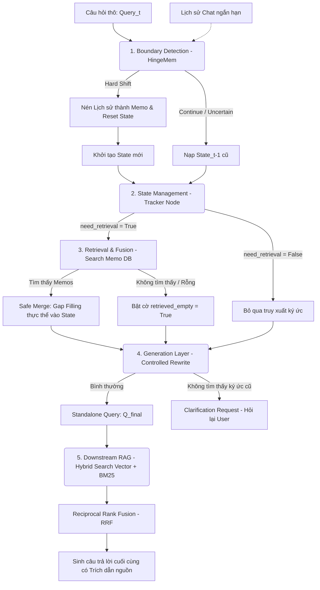

# MÔ TẢ CHI TIẾT KIẾN TRÚC & PIPELINE TRUY VẤN ĐA LƯỢT (MULTI-TURN RAG QUERY REWRITER)

Hệ thống RAG Chuẩn mực Kế toán Việt Nam (VAS) được xây dựng trên một kiến trúc xử lý hội thoại đa lượt đặc thù: **State-Centric Adaptive Pipeline**. Mục đích cốt lõi của pipeline này là theo dõi trạng thái ngữ cảnh hội thoại, giải quyết các đại từ mơ hồ hoặc thực thể bị lược bỏ, và viết lại câu hỏi gốc của người dùng thành câu truy vấn độc lập ($Q_{final}$) tối ưu nhất trước khi đưa vào RAG tìm kiếm tri thức.

---

## 1. Tại sao cần Pipeline Viết lại Câu hỏi (Query Rewriter)?

Trong giao tiếp thông thường, người dùng có xu hướng đặt các câu hỏi liên kết chéo hoặc rút gọn ở lượt chat sau:
- **Lượt 1:** "Hàng tồn kho là gì?" *(Rõ ràng)*
- **Lượt 2:** "Giá gốc của **nó** gồm những chi phí nào?" *("nó" thay thế cho "Hàng tồn kho")*
- **Lượt 3:** "Có phương pháp tính khấu hao nào cho **loại tài sản này**?" *("loại tài sản này" thay thế cho "Hàng tồn kho")*

Nếu trực tiếp lấy câu hỏi ở lượt 2 hoặc lượt 3 để thực hiện tìm kiếm vector hay từ khóa (BM25) trên tài liệu chuẩn mực VAS, hệ thống RAG sẽ thất bại vì:
1. Từ khóa "nó" hoặc "loại tài sản này" không mang thông tin ngữ nghĩa thực tế của đối tượng cần tra cứu.
2. Các tài liệu văn bản pháp lý chỉ chứa các danh từ chính xác như "Hàng tồn kho", chứ không chứa các đại từ chỉ định thay thế.

**Giải pháp:** Pipeline này đóng vai trò như một bộ dịch ngữ cảnh trung gian. Nó sử dụng LLM để quản lý trạng thái, truy xuất "ký ức" hội thoại cũ, và sinh ra một câu hỏi độc lập $Q_{final}$ (ví dụ: *"Giá gốc của hàng tồn kho gồm những chi phí nào?"*).

---

## 2. Bản đồ Luồng Dữ liệu (Pipeline Data Flow)

Dưới đây là sơ đồ Mermaid mô tả trực quan luồng xử lý từ lúc nhận câu hỏi thô đến khi sinh ra câu trả lời RAG cuối cùng:

---

## 3. Chi tiết các Lớp Xử lý trong Pipeline

### Lớp 1: Phân tích Biên ngữ cảnh (Boundary Detection Layer)
Nhiệm vụ của lớp này là xác định xem người dùng đang tiếp tục hỏi sâu về chủ đề cũ hay đã chuyển sang một chủ đề hoàn toàn mới.
- **HingeMem (Rule-based):** Sử dụng thuật toán so khớp từ khóa nhanh (độ tương đồng Jaccard) giữa câu hỏi mới và lượt chat cuối cùng. Nếu có từ khóa kế toán trùng nhau, hệ thống tự động xác định là `continue` (tiếp tục chủ đề cũ).
- **Fallback (SLM):** Nếu 2 câu hỏi hoàn toàn không chung từ khóa (0 overlap), hệ thống sẽ gửi câu hỏi kèm lịch sử ngắn sang mô hình cục bộ `qwen2.5:3b` thông qua `FALLBACK_PROMPT` để thẩm định xem đó là sự đổi chủ đề đột ngột (`hard_shift`) hay vẫn tiếp tục thảo luận ngữ nghĩa sâu (`continue`).
- **Memo Creation & Reset State (Khi có Hard Shift):** 
  - Lưu trữ: Toàn bộ lịch sử cuộc trò chuyện ngắn hạn cũ sẽ được LLM tóm tắt thành chủ đề (`Topic`) và nội dung chính (`Summary`), sau đó đẩy vào `Memo DB` (ChromaDB) để làm ký ức dài hạn của Session.
  - Reset: Trạng thái hội thoại hiện thời sẽ bị xóa sạch (`State = ConversationState()`) để tránh việc các thực thể của chủ đề trước bị "rò rỉ" sang câu hỏi của chủ đề mới.

### Lớp 2: Quản lý Trạng thái (State Management Layer)
Trạng thái hội thoại được cấu trúc hóa dưới dạng JSON theo định nghĩa tại [schema.py](file:///d:/school/Các vấn đề/retrieval-multiturn-rag/src/core/schema.py):
- `intent`: Ý định của người dùng (ví dụ: `inquiry`, `compare`, `list`).
- `entities`: Key-Value lưu trữ các đối tượng kế toán cốt lõi (ví dụ: `{"tài_sản": "Hàng tồn kho"}`).
- `attributes`: Các thuộc tính đi kèm đối tượng (ví dụ: `{"khái_niệm": "Giá gốc"}`).
- `constraints`: Các giới hạn hoặc điều kiện lọc dữ liệu.
- `unresolved_references`: Mảng chứa các đại từ thay thế mơ hồ cần giải quyết (ví dụ: `["nó"]`).

**Hoạt động của `state_tracker_node`:**
- Mô hình LLM phân tích câu hỏi mới kết hợp trạng thái `State_t-1` để cập nhật trạng thái mới `State_t`.
- Nếu phát hiện đại từ thay thế xuất hiện trực tiếp trong câu hỏi của người dùng, LLM đưa từ đó vào mảng `unresolved_references` và kích hoạt cờ `need_retrieval = True`. Nếu không có từ thay thế nào, cờ này sẽ bằng `False`.

### Lớp 3: Truy xuất & Hợp nhất (Retrieval & Fusion Layer)
- **Truy xuất ký ức (Retrieve Memo):** Khi `need_retrieval` bằng `True`, hệ thống truy vấn kho ký ức hội thoại dài hạn (`Memo DB`) bằng từ khóa là các thực thể hiện có hoặc chính đại từ thay thế.
- **Hợp nhất ký ức (Memory Fusion / Safe Merge):** 
  - Nếu tìm thấy các bản tóm tắt quá khứ phù hợp, hệ thống thực hiện thuật toán **Safe Merge** tại [retriever.py](file:///d:/school/Các vấn đề/retrieval-multiturn-rag/src/nodes/retriever.py).
  - Thuật toán này chỉ lấp đầy các thuộc tính và thực thể trống của trạng thái hiện tại (Gap Filling) bằng thông tin lấy từ Memo cũ, tuyệt đối không ghi đè lên các thực thể mới mà người dùng vừa đề cập trực tiếp.
  - Sau khi hợp nhất thành công, mảng `unresolved_references` sẽ được dọn sạch (`[]`).
  - Nếu không tìm thấy bất kỳ Memo nào phù hợp trong DB, cờ `retrieved_empty = True` được bật lên.

### Lớp 4: Tái cấu trúc & Đầu ra (Generation Layer)
- **Controlled Rewrite:** Sử dụng `REWRITE_PROMPT` đưa toàn bộ thực thể, thuộc tính và ràng buộc hiện có để viết lại câu hỏi thô thành câu hỏi độc lập đầy đủ nghĩa ($Q_{final}$).
- **Tránh ảo giác (Handling Empty Retrieval):** Nếu hệ thống nhận diện được người dùng đang hỏi về một đối tượng cũ (cờ `need_retrieval = True`) nhưng cơ sở dữ liệu ký ức lại không tìm thấy gì (`retrieved_empty = True`), thay vì cố đoán bừa và sinh ra thông tin ảo giác, hệ thống sẽ thực hiện **Graceful Fallback**: trả về một câu hỏi làm rõ (Clarification Request) yêu cầu người dùng cung cấp trực tiếp danh từ hoặc thông tin chính xác.

---

## 4. Quy trình RAG Hạ nguồn (Downstream RAG Pipeline)

Sau khi câu hỏi $Q_{final}$ độc lập được sinh ra từ pipeline trên, nó sẽ được chuyển tới `VASRAGSystem.run()` để thực hiện tra cứu tri thức chuẩn mực VAS thực tế:

1. **Truy xuất lai (Hybrid Search):**
   - **Vector Search:** Thực hiện tìm kiếm tương đồng trên ChromaDB chứa tri thức chuẩn mực kế toán VAS (kết hợp mô hình `nomic-embed-text` chạy local thông qua Ollama) để bắt thông tin ngữ nghĩa sâu.
   - **BM25 Search:** Thực hiện tìm kiếm từ khóa chính xác dựa trên các thực thể/thuộc tính kế toán được lưu trữ trong State.
2. **Hợp nhất kết quả (Reciprocal Rank Fusion - RRF):**
   - Trộn các kết quả thu được từ Vector Search (trọng số `1.0`) và BM25 (trọng số `0.8`) bằng thuật toán xếp hạng RRF nhằm đưa ra top 3 chunks tài liệu có độ liên quan cao nhất, giảm thiểu lỗi bỏ sót thông tin.
3. **Sinh câu trả lời có trích dẫn (Answer Generation):**
   - LLM sinh câu trả lời dựa trên ngữ cảnh đã lọc sạch bằng `ANSWER_PROMPT`.
   - Bắt buộc trích dẫn nguồn cụ thể ở cuối mỗi ý (ví dụ: `[Nguồn 1]`, `[Nguồn 2]`) kèm theo tiêu đề chuẩn mực của tài liệu để người dùng dễ dàng tra cứu đối chiếu.

---

## 5. Tổ chức Thư mục & Bản đồ Code

Kiến trúc sạch (Clean Architecture) của dự án được triển khai phân rã như sau:

| Thành phần / File | Vị trí / Đường dẫn | Vai trò |
| :--- | :--- | :--- |
| **Pipeline chính** | [pipeline.py](file:///d:/school/Các vấn đề/retrieval-multiturn-rag/src/core/pipeline.py) | Điều phối luồng dữ liệu chính của bộ viết lại câu hỏi. |
| **RAG System** | [rag_system.py](file:///d:/school/Các vấn đề/retrieval-multiturn-rag/src/core/rag_system.py) | Nhận $Q_{final}$, thực hiện Hybrid Search, RRF và gọi LLM sinh câu trả lời. |
| **Node Biên hội thoại** | [boundary.py](file:///d:/school/Các vấn đề/retrieval-multiturn-rag/src/nodes/boundary.py) | Quyết định xem cuộc hội thoại có chuyển chủ đề (`hard_shift`) hay không. |
| **Node State Tracker** | [tracker.py](file:///d:/school/Các vấn đề/retrieval-multiturn-rag/src/nodes/tracker.py) | Phân tích thực thể, thuộc tính và cập nhật trạng thái hội thoại. |
| **Node Fusion & Merge** | [retriever.py](file:///d:/school/Các vấn đề/retrieval-multiturn-rag/src/nodes/retriever.py) | Thực hiện thuật toán Safe Merge để bù đắp các thực thể thiếu từ Memo cũ. |
| **Node Rewriter** | [rewriter.py](file:///d:/school/Các vấn đề/retrieval-multiturn-rag/src/nodes/rewriter.py) | Sử dụng LLM viết lại câu hỏi hoặc sinh câu hỏi làm rõ nếu rỗng ký ức. |
| **Quản lý State & Cache** | [state.py](file:///d:/school/Các vấn đề/retrieval-multiturn-rag/src/core/state.py) | Quản lý bộ nhớ đệm lịch sử chat ngắn hạn và tóm tắt nén lưu trữ dài hạn vào Memo DB. |
| **Định nghĩa Schemas** | [schema.py](file:///d:/school/Các vấn đề/retrieval-multiturn-rag/src/core/schema.py) | Định nghĩa các cấu trúc dữ liệu Pydantic phục vụ cho việc tracking và RAG. |
| **Kho Prompts LLM** | [llm.py](file:///d:/school/Các vấn đề/retrieval-multiturn-rag/src/services/llm.py) | Nơi tập trung tập hợp tất cả các hệ thống Prompts đã tối ưu của toàn bộ hệ thống. |
| **Quản lý Database** | [vector_db.py](file:///d:/school/Các vấn đề/retrieval-multiturn-rag/src/services/vector_db.py) | Cung cấp các API kết nối ChromaDB cho cả Expert DB (tri thức) và Memo DB (ký ức). |

---
> [!NOTE]
> Toàn bộ logic viết lại và giải quyết đại từ mập mờ được thiết kế chạy tự động thông qua khả năng lập luận của LLM (`qwen2.5:3b`) bằng prompt tối ưu mà không phụ thuộc vào các điều kiện lọc tĩnh bằng code Python, giúp hệ thống duy trì tính linh hoạt tối đa khi mở rộng sang các dạng câu hỏi khác nhau.
