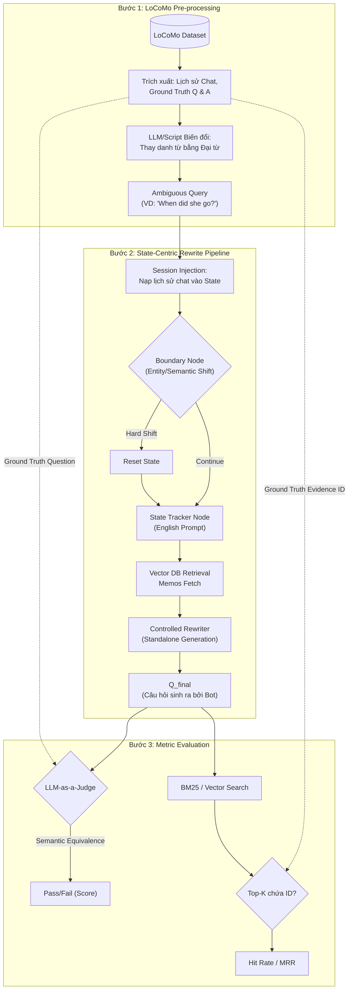

# Môi trường Đánh giá (Evaluation Pipeline)
*(Thư mục: `pipeline_eval`)*

Thư mục `pipeline_eval` là một bản sao chép (Mirror) kiến trúc của hệ thống chính (`src`) nhưng được tùy biến riêng để phục vụ cho công tác **Đánh giá Hiệu năng (Benchmarking)** trên các bộ dữ liệu quốc tế như **LoCoMo**.

---

## 1. Vai trò của `pipeline_eval`

1. **Độc lập và An toàn:** Tách biệt hoàn toàn với mã nguồn Production (thư mục `src`). Bạn có thể thoải mái thử nghiệm các heuristic mới, điều chỉnh prompt mà không làm ảnh hưởng đến ứng dụng đang chạy.
2. **Tương thích Tiếng Anh (English-native):** Toàn bộ hệ thống Prompt của các LLM Node (Tracker, Rewriter, v.v.) trong thư mục này đã được dịch hoàn toàn sang Tiếng Anh để khớp với ngôn ngữ của bộ dữ liệu LoCoMo.
3. **Đánh giá Benchmark (LoCoMo):** Là nơi chứa các script thực hiện tự động hóa quy trình đọc dữ liệu hội thoại, nạp lịch sử, biến đổi câu hỏi (làm mờ thành đại từ) và đo lường độ chính xác của Rewriter.
4. **Tối ưu chi phí (Heuristic Boundary):** Riêng tại Node Boundary của `pipeline_eval`, hệ thống sử dụng hoàn toàn Heuristics (đo Entity Shift và Semantic Shift) thay vì dùng LLM Fallback, nhằm tăng tốc độ test và giảm chi phí API khi chạy trên bộ dataset khổng lồ.

---

## 2. Sơ đồ Luồng hoạt động Đánh giá (Evaluation Flowchart)

Khác với Pipeline thông thường chỉ nhận Input từ người dùng trực tiếp, Pipeline Đánh giá cần có các bước tiền xử lý (Pre-processing) và chấm điểm (Judging).

---

## 3. Chi tiết các Bước Đánh giá

### Bước 1: Tiền xử lý Dữ liệu (LoCoMo Pre-processing)
- Bộ dữ liệu LoCoMo cung cấp lịch sử chat và các mảng Hỏi - Đáp (với câu hỏi gốc rõ nghĩa).
- Script đánh giá sẽ trích xuất một **Ground Truth Query**. 
- Dùng một đoạn mã NLP nhỏ thay thế Danh từ chính bằng Đại từ tương ứng để tạo ra một **Ambiguous Query** (Câu hỏi lấp lửng). Đây sẽ là bài test thực sự cho hệ thống.

### Bước 2: Chạy Evaluation Pipeline (Core)
- **Session Injection:** Bơm các lượt thoại quá khứ từ dataset vào cho Node Boundary và Tracker xử lý trước để hệ thống xây dựng được Memos dài hạn trong cơ sở dữ liệu.
- Đưa **Ambiguous Query** vào làm câu hỏi lượt cuối. 
- Hệ thống thực hiện việc chẩn đoán State, phát hiện mất dấu, fetch Memos từ DB, và đưa vào Rewriter để biến nó thành câu hỏi độc lập ($Q_{final}$).

### Bước 3: Chấm điểm (Metric Evaluation)
Hệ thống sử dụng song song 2 phương pháp chấm điểm để đảm bảo tính khách quan:
1. **LLM Judge (Kiểm tra Ngữ nghĩa):** Sử dụng một LLM độc lập (ví dụ: GPT-4) so sánh $Q_{final}$ với câu hỏi Ground Truth gốc của LoCoMo. Trả về `1` nếu hai câu hỏi cùng bản chất ngữ nghĩa, `0` nếu lệch.
2. **Retrieval Hit-Rate (Đánh giá RAG downstream):** Dùng $Q_{final}$ tìm kiếm trực tiếp trong bộ lịch sử chat bằng BM25/Vector Search. Nếu trong danh sách trả về (Top-K) có chứa đúng ID của đoạn hội thoại được đánh dấu trong trường `evidence` của LoCoMo thì tính là Hit.
