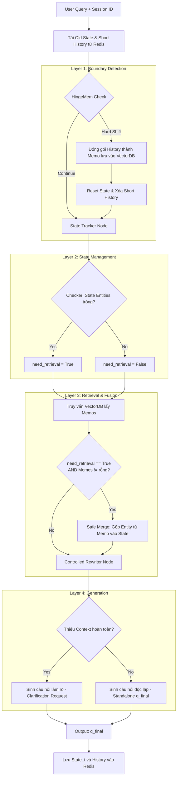

# Kiến trúc State-Centric Adaptive Pipeline

Tài liệu này mô tả chi tiết cách hoạt động của Pipeline viết lại truy vấn (Query Rewriting) xử lý ngữ cảnh đa lượt (Multi-turn RAG) kết hợp với trí nhớ dài hạn (Long-term Memory / Memos).

## 1. Sơ đồ Pipeline tổng quát (Architecture Diagram)

---

## 2. Chi tiết từng Node trong Pipeline

Pipeline hoạt động theo luồng tuyến tính đi qua 4 tầng (Layers) chính:

### Layer 1: Boundary Detection (Phát hiện vùng biên)
- **Nhiệm vụ**: Xác định xem câu hỏi mới của người dùng đang tiếp tục chủ đề cũ (Continue) hay đã chuyển sang một chủ đề hoàn toàn mới (Hard Shift).
- **Thuật toán (Heuristics)**:
  1. **Token/Length Limit**: Nếu bộ nhớ ngắn hạn vượt quá ~2000 tokens (8000 kí tự), tự động ngắt để tránh tràn RAM -> `Hard Shift`.
  2. **Pronoun Check**: Nếu câu có đại từ (`it`, `he`, `she`, `that`...) -> Có tính liên kết ngữ cảnh -> Chắc chắn là `Continue`.
  3. **Entity Shift & Semantic Shift**: Tính toán độ dời thực thể và độ dời ngữ nghĩa (qua Jaccard Distance). Nếu `Entity Shift > 0.5` VÀ `Semantic Shift > 0.4` -> Chuyển chủ đề -> `Hard Shift`.
- **Hành động khi Hard Shift**: Pipeline sẽ **đóng gói** toàn bộ lịch sử chat ngắn hạn trước đó (cùng với State) tạo thành một **Memo** (Trí nhớ dài hạn) và ném vào Vector DB. Sau đó xóa sạch Short History và Reset lại State để bắt đầu chủ đề mới.

### Layer 2: State Tracker & Checker (Quản lý trạng thái)
- **Nhiệm vụ**: Theo dõi và cập nhật những thông tin cốt lõi mà người dùng và AI đang trao đổi.
- **Cách hoạt động**:
  - Nhận vào `Raw Query` và `Old State` (Trạng thái ở lượt $t-1$).
  - Gọi LLM để trích xuất: Mục đích (Intent), Thực thể (Entities), Thuộc tính (Attributes) và các Đại từ chưa giải quyết (Unresolved References).
  - LLM sẽ tự động **Merge (Gộp)** các Entities cũ vào State mới để giữ nguyên mạch hội thoại.
- **Checker Logic**: Sau khi gộp, hệ thống sẽ kiểm tra xem `State.entities` có bị rỗng hay không.
  - Nếu rỗng $\rightarrow$ AI đang "mất dấu" đối tượng được nhắc đến $\rightarrow$ Đặt cờ `need_retrieval = True`.
  - Nếu có chứa entity $\rightarrow$ Đặt cờ `need_retrieval = False`.

### Layer 3: Retrieval & Fusion (Truy xuất và Hợp nhất)
- **Nhiệm vụ**: Móc nối trí nhớ dài hạn (Memos) từ Vector DB nếu cần thiết để bù đắp ngữ cảnh.
- **Cách hoạt động**:
  1. Luôn dùng từ khóa trong State (hoặc Raw Query) để search trong Vector DB lấy ra các Memos (những đoạn chat/chủ đề cũ đã được đóng gói).
  2. Nếu cờ `need_retrieval = True` VÀ tìm thấy Memos, hệ thống kích hoạt **Safe Merge**.
  3. **Safe Merge**: Thuật toán trích xuất các Entities/Attributes từ Memo tìm được và "bơm" (nhồi) ngược vào State hiện tại đang bị trống.

### Layer 4: Controlled Rewriter (Viết lại câu hỏi)
- **Nhiệm vụ**: Biến câu hỏi lấp lửng (chứa đại từ) thành câu hỏi Độc lập (Standalone Query) chứa đầy đủ thông tin để đem đi search tài liệu RAG.
- **Cách hoạt động**:
  - Nhận vào `Raw Query`, `New State` (đã qua Fusion), và danh sách `Memos`.
  - LLM sẽ nhìn vào các Entities cụ thể trong State và thay thế các đại từ ("nó", "anh ấy", "cái đó") bằng chính xác tên của Entity.
- **Graceful Fallback (Xử lý lỗi)**: Nếu State không có Entity nào VÀ Memos cũng không tìm thấy (Người dùng hỏi lấp lửng nhưng không có bất kì ngữ cảnh nào trước đó), hệ thống sẽ từ chối đoán mò. Thay vào đó, nó xuất ra một **Clarification Request** (Câu hỏi làm rõ - ví dụ: *"Bạn đang nhắc đến 'cái đó' là cái gì vậy?"*).
